# Lingo — Duolingo-style Web App 🦉

---
## 🌐 Live Demo
| Service | URL |
|---------|-----|
| Frontend (Vercel) | https://duolingo-26bg.vercel.app/learn |
| Backend API (Render) | https://duolingo-sreb.onrender.com |
| API Documentation | https://duolingo-sreb.onrender.com/docs |
---

## Project Description

Lingo is a Duolingo-style language learning web app I built as a full-stack assignment. The idea was to recreate the parts of Duolingo that actually make it feel like Duolingo — the skill tree that gates lessons behind progress, the lesson player with instant right/wrong feedback, the hearts you lose on wrong answers, the streak that ticks up each day, and the XP that pushes you toward a daily goal — inside a UI that looks and behaves like the real thing.

The lesson loop is the heart of the app. A learner picks a skill from the path, moves through a mix of multiple-choice, word-bank translate, match-pairs, fill-in-the-blank, and type-the-answer exercises, gets immediate feedback with a slide-up bar, loses a heart on a wrong answer, and finishes to a confetti-and-mascot completion modal that shows the XP earned. Everything they earned — XP, streak, hearts, skill crowns — persists in a real database, so their progress is still there when they come back.

To make it feel less like a class project and more like a real app, I went a bit past the spec: real (but simple) JWT authentication with bcrypt-hashed passwords so multiple learners can each have their own progress, browser text-to-speech on exercises for a "listen again" experience, a legendary/timed practice mode that doubles XP on success, dark mode as the default (matching Duolingo's web UI) with a light-mode toggle, and a responsive layout that collapses cleanly from desktop sidebar down to a mobile bottom tab bar.

The backend is FastAPI with SQLAlchemy over SQLite, structured in clear layers (routes → business logic → data access) with pure-ish, time-injectable functions for the gamification rules so the trickiest logic (streak day-rollover, hearts regen over elapsed time) is genuinely unit-testable without sleeping or mocking the clock. The frontend is Next.js 14 with the App Router and Tailwind, built out of small reusable components.

---

## Features

* Skill tree / learning path with lock, available, and completed states
* Progress rings and crowns per skill
* Top bar with streak, XP, hearts, and mocked gems
* Lesson player with five exercise types (multiple choice, translate word-bank, match pairs, fill-in-the-blank, type-the-answer)
* Immediate correct / incorrect feedback with the signature slide-up bar
* Hearts system — lose one per wrong answer, run out and the lesson fails
* Hearts regenerate over real elapsed time (no cron job needed) or refill with gems
* XP awarded per correct answer, plus a lesson-completion bonus
* Streak counter with real day-rollover logic (increments on consecutive days, resets on a gap)
* Daily XP goal with a "goal met!" celebration
* Real leaderboard across seeded users, ranked by total XP
* Learner profile with stats, achievements, and crowns
* User authentication — register, login, JWT-secured routes, per-user progress isolation
* Text-to-speech on exercises (normal + slow 🐢 playback)
* Legendary / timed practice mode with double XP
* Dark mode (default) with light mode toggle, persisted to localStorage
* Responsive layout (desktop sidebar → tablet icon rail → mobile bottom tab bar)
* Animations — bouncing mascot, shake on wrong answer, slide-up feedback bar, confetti on completion
* Lesson-complete modal with XP, accuracy, and streak
* Out-of-hearts modal with gem-refill option
* All progress persisted per user in SQLite

---

## 📸 Application Screenshots

<table>
<tr>
<td align="center" width="50%">
<a href="./assets/1.png">
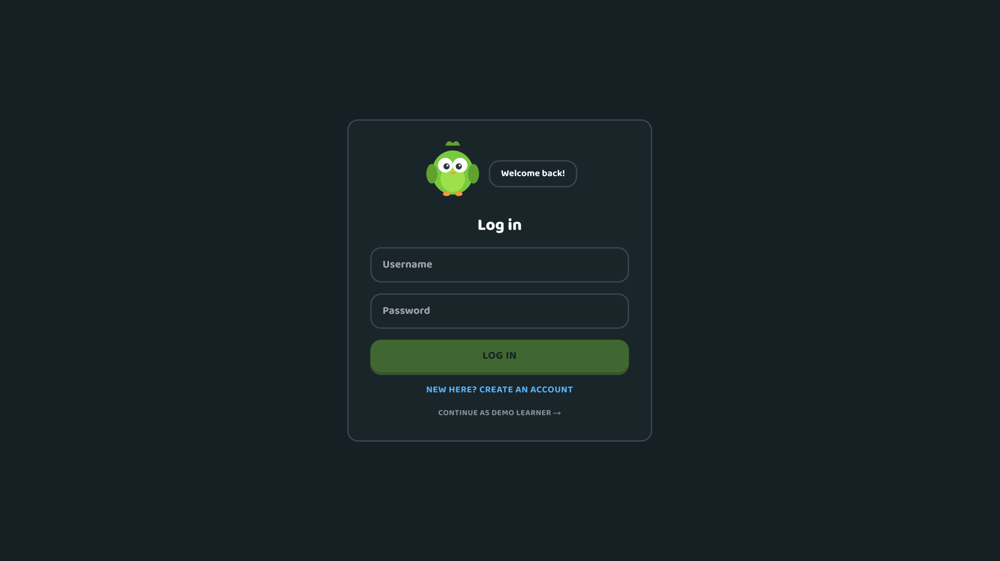
</a>
</td>

<td align="center" width="50%">
<a href="./assets/2.png">
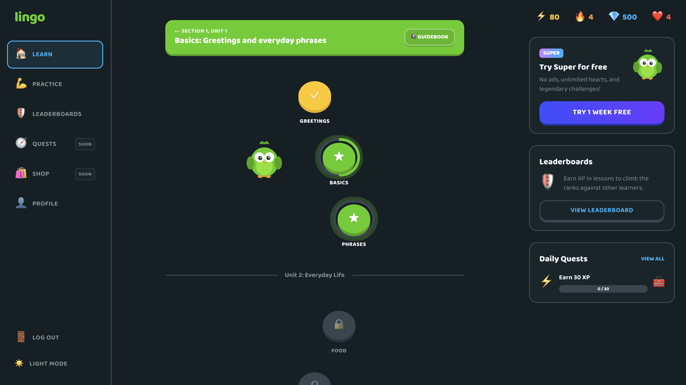
</a>
</td>
</tr>

<tr>
<td align="center">
<a href="./assets/3.png">
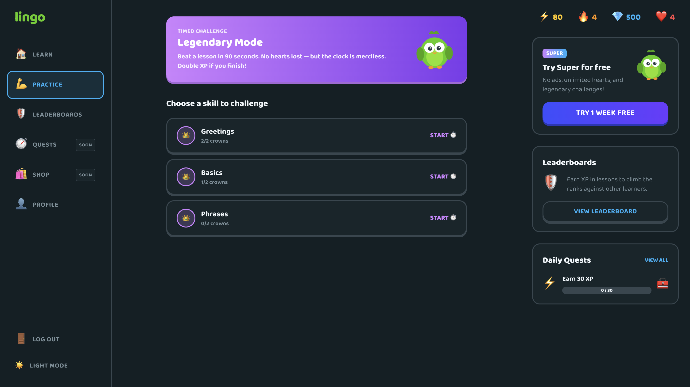
</a>
</td>

<td align="center">
<a href="./assets/4.png">
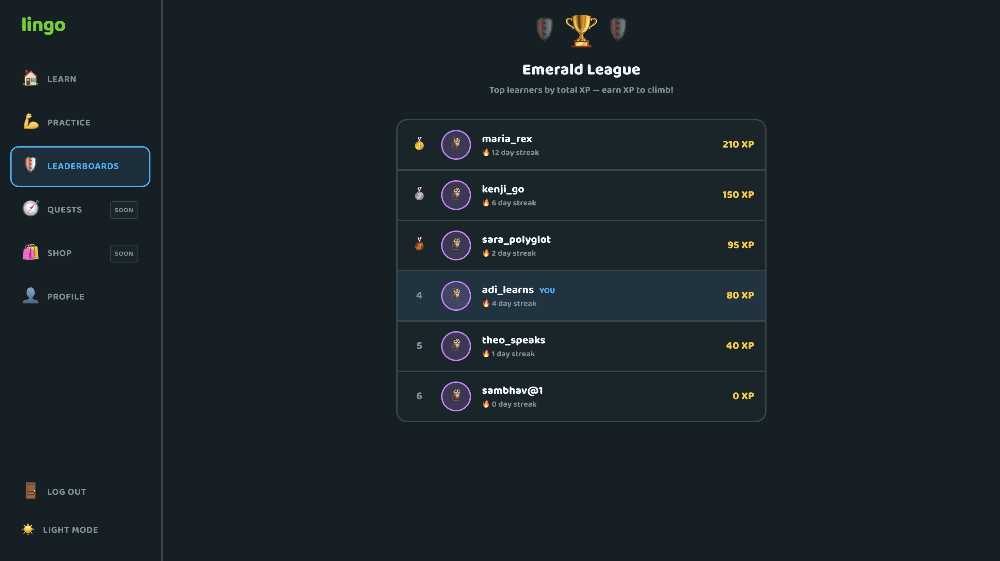
</a>
</td>
</tr>

<tr>
<td align="center">
<a href="./assets/5.png">
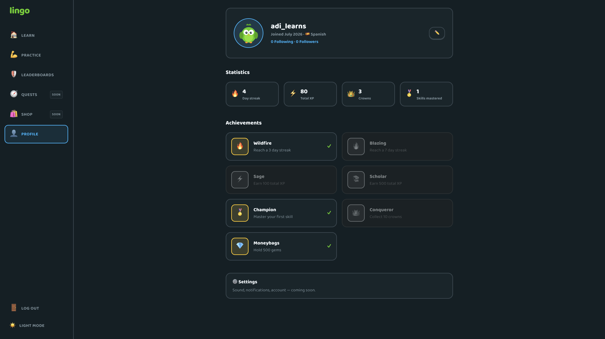
</a>
</td>

<td align="center">
<a href="./assets/6.png">
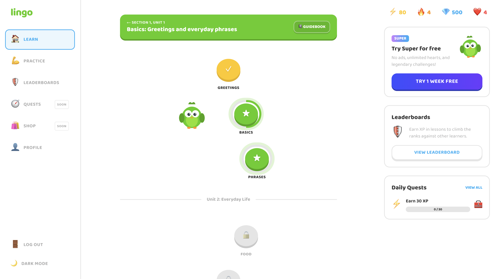
</a>
</td>
</tr>

<tr>
<td align="center">
<a href="./assets/7.png">
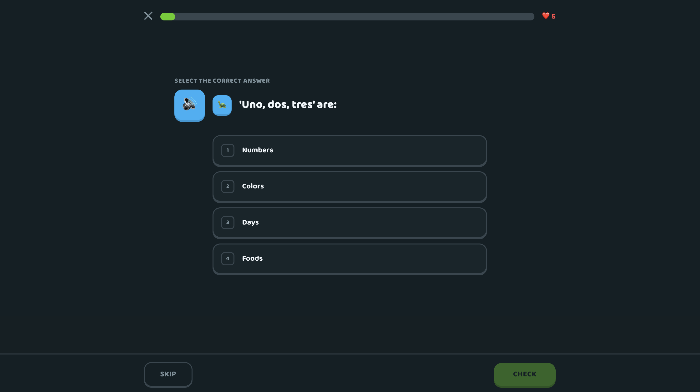
</a>
</td>

<td align="center">
<a href="./assets/8.png">
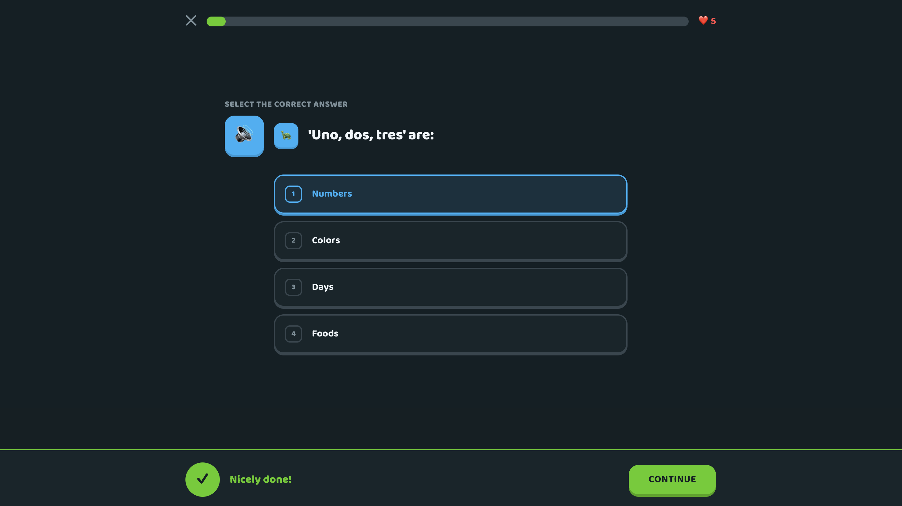
</a>
</td>
</tr>

<tr>
<td align="center">
<a href="./assets/9.png">
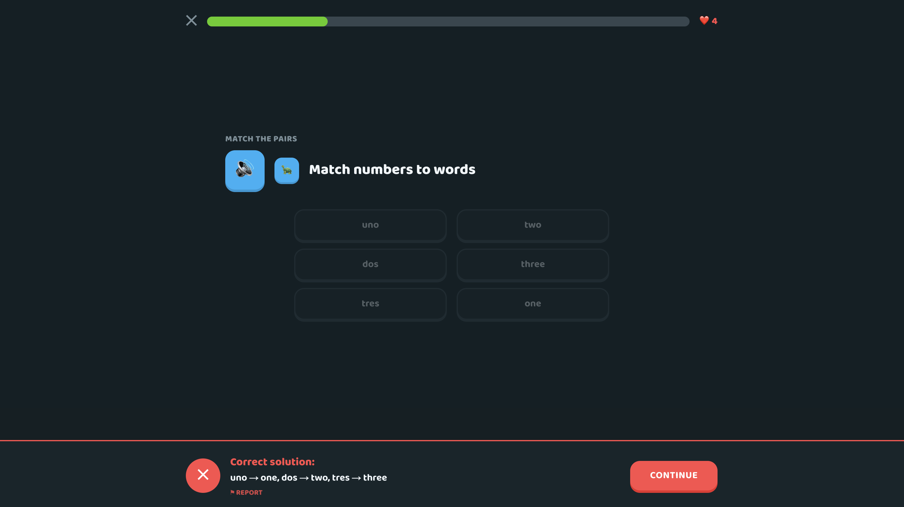
</a>
</td>

<td align="center">
<a href="./assets/10.png">
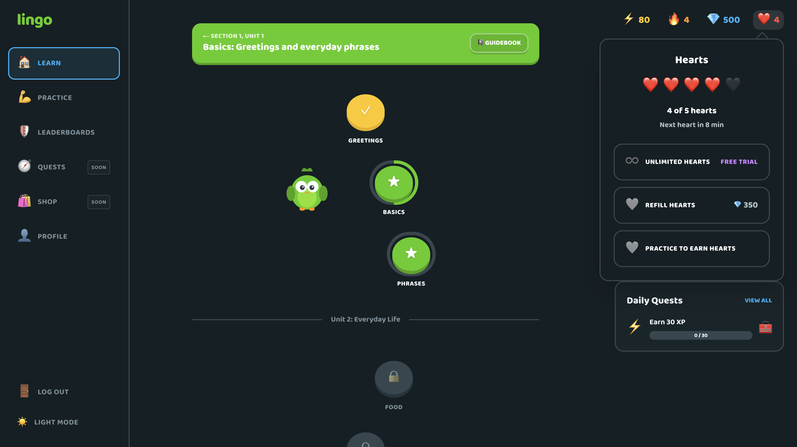
</a>
</td>
</tr>

<tr>
<td colspan="2" align="center">
<a href="./assets/11.png">
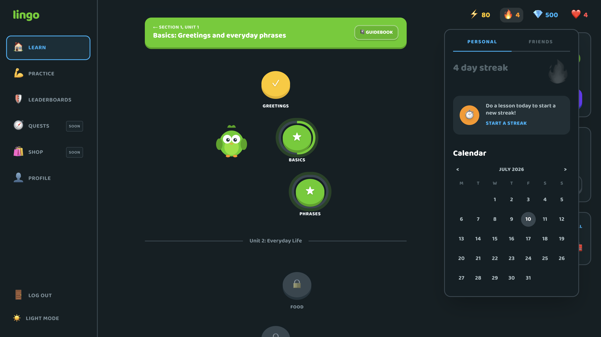
</a>
</td>
</tr>
</table>

## 🏗️ System Architecture

<p align="center">
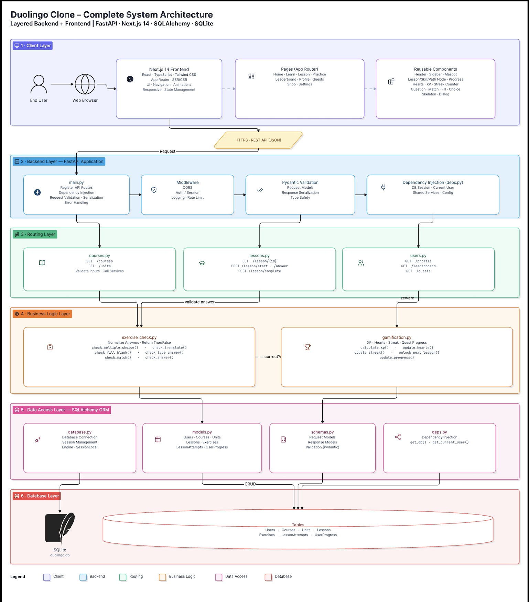
</p>

---
## ⚙️ Backend Architecture

<p align="center">
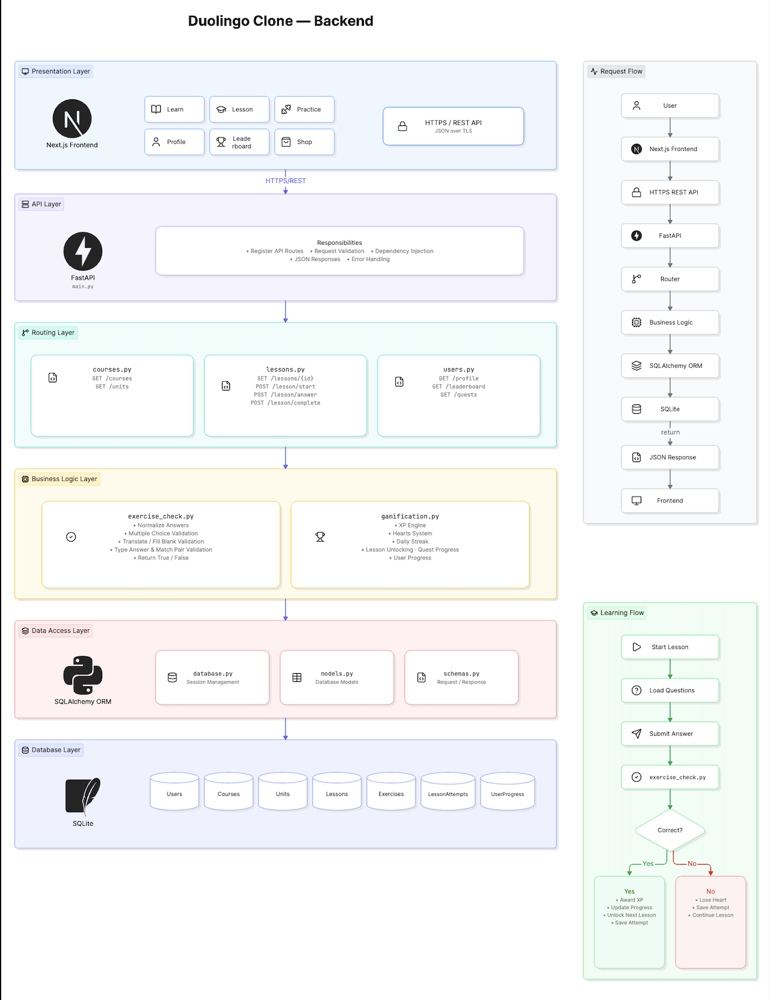
</p>
---
## 🎨 Frontend Architecture

<p align="center">
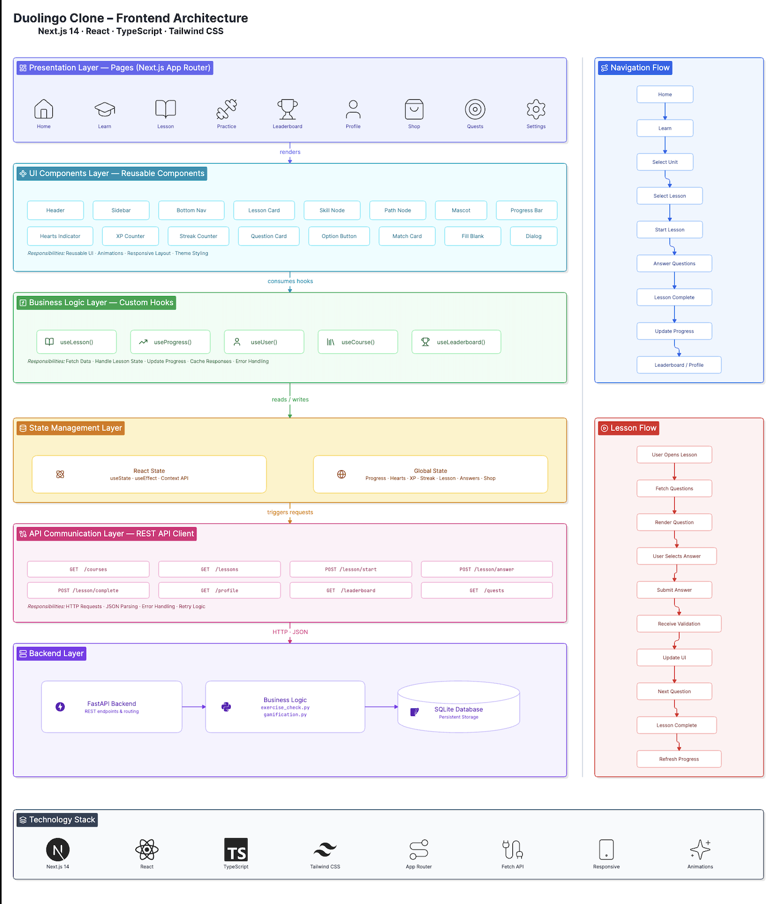
</p>

## Installation Steps

### Requirements

* Python 3.10 or newer
* Node.js 18 or newer
* npm

### Step 1 — Clone Repository

```bash
git clone https://github.com/Codechefskj/Duolingo.git
```

### Step 2 — Move Into Project Directory

```bash
cd Duolingo
```

### Step 3 — Backend Setup

Open a first terminal and run:

```bash
cd backend
python3 -m venv venv
source venv/bin/activate            # Windows: venv\Scripts\activate
pip install -r requirements.txt
python -m app.seed                  # creates duolingo.db with seed content + demo user
uvicorn app.main:app --reload --port 8000
```

The backend runs locally at `http://localhost:8000`.

Interactive API docs (Local):
http://localhost:8000/docs

Production API:
https://duolingo-sreb.onrender.com/

Production API Docs:
https://duolingo-sreb.onrender.com/docs


### Step 4 — Frontend Setup

Open a second terminal (leave the backend running) and run:

```bash
cd frontend
npm install
cp .env.example .env.local
npm run dev
```
Set the environment variable:

```env
NEXT_PUBLIC_API_URL=http://localhost:8000
```

For production (Vercel):

```env
NEXT_PUBLIC_API_URL=https://duolingo-sreb.onrender.com
```

Open `http://localhost:3000` in the browser. `/` redirects to `/learn`.

### Step 5 — Log In (Optional)

The app loads as the seeded demo learner (Adi, 80 XP, 4-day streak) with no login required. Click **🔑 Log in** in the sidebar to register a new account or log in — a new account starts fresh at 0 XP with the first skill unlocked.

### Step 6 — Reset Progress

Rerunning `python -m app.seed` wipes and rebuilds the DB back to the demo state — useful during development.

---

## Project Structure

```text
Duolingo/
│
├── backend/
│   ├── app/
│   │   ├── main.py                # FastAPI app + CORS + router registration
│   │   ├── database.py            # SQLAlchemy engine, SessionLocal, get_db
│   │   ├── models.py              # ORM models (User, Course, Unit, Skill, Lesson, Exercise, ...)
│   │   ├── schemas.py             # Pydantic request/response shapes
│   │   ├── deps.py                # get_current_user — token auth with demo fallback
│   │   ├── auth.py                # bcrypt password hashing + JWT helpers
│   │   ├── gamification.py        # hearts, streak, XP, unlock derivation
│   │   ├── exercise_check.py      # per-type answer checking
│   │   ├── seed.py                # course + demo user seed data
│   │   ├── routers/
│   │   │   ├── auth.py            # POST /auth/register, POST /auth/login
│   │   │   ├── courses.py         # GET /courses, /courses/{id}
│   │   │   ├── lessons.py         # start / answer / complete lesson loop
│   │   │   └── users.py           # stats, profile, leaderboard, hearts refill
│   │   ├── test_gamification.py   # streak, hearts regen, gems refill
│   │   ├── test_exercise_check.py # all 5 exercise types + dispatcher
│   │   └── test_auth.py           # register → login → authed request
│   └── requirements.txt
│
├── frontend/
│   ├── app/                       # Next.js App Router pages
│   │   ├── learn/                 # skill tree / learning path
│   │   ├── lesson/[lessonId]/     # lesson player
│   │   ├── practice/              # legendary / timed practice
│   │   ├── leaderboard/           # ranked seeded users
│   │   ├── profile/               # stats + achievements
│   │   ├── login/                 # register / login page
│   │   ├── quests/, shop/         # placeholder "coming soon" pages
│   │   └── layout.tsx, page.tsx
│   ├── components/
│   │   ├── LessonPlayer.tsx       # lesson state machine
│   │   ├── ExerciseRenderer.tsx   # dispatches on exercise type
│   │   ├── exercises/             # one component per exercise type
│   │   ├── SkillPath.tsx, SkillNode.tsx, PathNode.tsx
│   │   ├── TopBar.tsx, TopStats.tsx, RightRail.tsx
│   │   ├── Sidebar.tsx            # navigation + log in / log out button
│   │   ├── FeedbackBar.tsx, Modal.tsx, Mascot.tsx, Confetti.tsx
│   │   ├── TTSButton.tsx          # text-to-speech
│   │   └── ThemeToggle.tsx
│   ├── lib/
│   │   ├── api.ts                 # fetch client, token storage, auth header
│   │   └── types.ts               # shared TS types matching backend schemas
│   ├── package.json
│   └── tailwind.config.ts
│
└── README.md
```

---

## Navigation Structure

The app uses Next.js App Router. The sidebar is persistent on desktop; on mobile it collapses to a bottom tab bar with the same icons.

### Sidebar / Bottom Tabs

* Learn — the skill tree home
* Practice — legendary/timed runs on unlocked skills
* Leaderboards
* Profile
* Quests, Shop — "Coming soon" placeholders

### Stack

* Login page sits outside the main app shell
* Lesson player takes over the whole screen when a lesson is active

Tapping a skill on the path opens its next lesson; the ✕ in the corner brings you straight back to the tree. The flow stays predictable — one path in, one path out.

---

## The Lesson Loop

The lesson loop is a three-endpoint state machine on the backend, mirrored by a small state machine in `LessonPlayer.tsx` on the frontend.

```text
POST /lessons/{id}/start              → create LessonAttempt, return exercises (no answers!)
POST /lesson-attempts/{id}/answer     → check one answer, deduct a heart if wrong
POST /lesson-attempts/{id}/complete   → tally XP, update streak, award crowns
```

### Frontend Phases

`loading → active → checked → (active | complete | out_of_hearts | timeout)`

### Key Design Choice

Answer checking runs entirely on the server. The `start` endpoint deliberately never sends the correct answer to the client — it's returned only after the learner submits an attempt. A page refresh or a tampered client can't fabricate XP, skip a locked skill, or brute-force the right answer.

---

## State Management

Backend is the source of truth for anything that matters — XP, streak, hearts, skill progress. The frontend just renders what `/users/me/stats`, `/courses/{id}`, and `/users/me/profile` return, and posts user actions back.

### Client-side state

* React `useState` inside components for UI state (which exercise, current answer, feedback phase)
* `localStorage` for the JWT token and the theme preference
* No global store — every screen is small enough that hooks are enough

### Why not a client store?

Progress that lives on the client is progress that can drift or get spoofed. Since the whole gamification loop needs a trusted authority anyway, that authority is the API.

---

## Skill Unlock Derivation

Skill lock/unlock state is **not** stored as a column. It's derived on every read from crown progress plus the skill's order in the flattened unit → skill sequence.

### Rule

The first skill is always available. Every later skill unlocks once the previous skill has at least one crown earned. Completed = `crowns_earned ≥ max_crowns`.

### Benefit

There's no "unlocked" flag anywhere that can drift out of sync with actual progress. If crowns are right, unlocks are right. Fixing progress fixes unlocks automatically.

---

## Hearts Regeneration

Hearts refill over real elapsed time, but the app doesn't run a cron job to do it. Instead the current heart count is **lazily computed** on every stats read.

### Workflow

```text
Wrong answer
     │
     ▼
lose_heart()  → hearts -= 1, hearts_refill_at = now (if not already set)
     │
     ▼
(time passes — user might close the app for hours)
     │
     ▼
Next stats read
     │
     ▼
sync_hearts()  → floor((now - hearts_refill_at) / 30 min) hearts refilled, capped at max
```

### Benefit

No background job, no cron, no scheduler — hearts "just refill" the moment the user checks, even if they were away for hours. And the underlying function takes `now` as a parameter, so tests can simulate "30 minutes passed" without sleeping.

---

## Streak Logic

Streaks tick up on consecutive days of activity and reset on a gap. The rule is boring on paper but has three tricky cases:

* Same-day activity → streak unchanged
* Yesterday's activity → streak + 1
* Any older last-active-date → streak resets to 1

`update_streak_and_xp(stats, xp, today)` takes `today` as a parameter, so `test_gamification.py` simulates each case with a hardcoded date. No sleeping, no clock mocking.

---

## API Overview
 
All endpoints are JSON over HTTP. Requests carry `Authorization: Bearer <token>` when the learner is logged in; without a token, the API serves the seeded demo learner (spec-permitted default). Interactive docs are auto-generated at `http://localhost:8000/docs` when the backend is running.

## Authentication

Authentication is real but simple — bcrypt-hashed passwords stored server-side, stateless JWT access tokens returned on register/login, and a single `Authorization: Bearer <token>` header on every subsequent request.

### Endpoints

| Endpoint            | Purpose                                             |
| ------------------- | --------------------------------------------------- |
| POST `/auth/register` | Create account, bootstrap starting stats, return JWT |
| POST `/auth/login`  | Verify password, return JWT                         |

### The one-line insight

Every route already depended on `get_current_user`. Adding real auth touched exactly one file (`deps.py`) — no route handlers changed. Requests with a valid token act as that user; requests with no token fall back to the seeded demo learner (spec-permitted default); requests with an invalid or expired token get a 401, never a silent fallback.

### Password rules

Handled in Pydantic validators on `RegisterIn` — username ≥ 3 chars, password ≥ 6 chars. Duplicate usernames return 409. Login always returns the same generic 401 error whether the username is unknown or the password is wrong, so the endpoint doesn't leak which usernames exist.

---

## Database Schema

Six content tables plus three progress tables, all normalized with foreign keys.

### Content

* **Course** — a language (currently Spanish)
* **Unit** — a group of skills, ordered
* **Skill** — a tile on the path, has a `max_crowns` level
* **Lesson** — a sequence of exercises inside a skill; `order_index` == crown level - 1
* **Exercise** — one question. `type` + `options_json` + `correct_answer` (JSON-encoded)

### User & progress

* **User** — id, username, password_hash (nullable for pre-auth seeded users)
* **UserStats** — 1:1 with User. XP, streak, hearts, gems, daily goal
* **UserSkillProgress** — crowns earned per skill per user
* **LessonAttempt** — one per lesson start; status: `in_progress` / `completed` / `failed`
* **ExerciseAttempt** — one per submitted answer; correct or not

### Design tradeoff

A single `exercises` table with a JSON `options_json` column beats five near-duplicate exercise tables. The cost is losing DB-level shape validation for options; that validation gets pushed into the Pydantic schemas and the answer-checking layer instead.

---

## Automated Tests

Three test suites, seventy tests total, run via pytest.

| Suite                      | What it covers                                                    |
| -------------------------- | ----------------------------------------------------------------- |
| `test_gamification.py`     | Streak day-rollover, hearts regen over simulated elapsed time, gem refill |
| `test_exercise_check.py`   | All 5 exercise types, normalization edge cases, unknown-type error |
| `test_auth.py`             | Register → login → authenticated request, wrong password, duplicate username, expired token, malformed header, demo-user fallback |

```bash
cd backend
python -m pytest app/ -v
```

Every gamification function takes `now` / `today` as a parameter rather than reading the clock, so "a day passed" or "30 minutes elapsed" is simulated in tests, never slept. That's the reason all 70 tests run in under 5 seconds.

---

### Seed Data

The backend automatically seeds the database during the first deployment if it is empty. A demo learner and sample Spanish course are created automatically.
---

## 🛠 Tech Stack

### Frontend
- Next.js 14
- React
- TypeScript
- Tailwind CSS

### Backend
- FastAPI
- SQLAlchemy
- Pydantic
- JWT Authentication
- bcrypt

### Database
- SQLite

### Deployment
- Vercel
- Render
---

# 🚀 Deployment

## Frontend

- **Platform:** Vercel
- **URL:** https://duolingo-26bg.vercel.app/learn

## Backend

- **Platform:** Render
- **URL:** https://duolingo-sreb.onrender.com/

## API Documentation

- https://duolingo-sreb.onrender.com/docs

---

## Challenges Faced During Development

### Keeping unlock state honest

An early version stored `is_unlocked` as a boolean on `UserSkillProgress`. It drifted out of sync the moment I tested crown progress separately. Moving unlock to a derived computation (crowns_earned + previous skill's crowns_earned) meant there was no flag to drift — one source of truth, computed fresh every read.

### Hearts regeneration without a cron

Running a background job to tick hearts up every 30 minutes felt like a lot of machinery for a demo. Lazily computing hearts from `hearts_refill_at` and `now` on each stats read gave the same UX — hearts just "are" refilled when the user opens the app — with zero infrastructure.

### Making time-based logic testable

Hearts regen and streaks both depend on the clock, and I didn't want a test suite that slept for 30 minutes. Making every gamification function accept `now` / `today` as a parameter (defaulting to `datetime.utcnow()` / `date.today()` in production) let the tests inject whatever moment they needed. This is the single design decision that made the test suite genuinely useful.

### Adding auth without rewriting every route

The spec allowed a hardcoded demo learner, but real auth was more interesting. Because every route already depended on `get_current_user`, I could add JWT auth by changing exactly that one function — read the Bearer header, decode the token, load the user, fall back to demo if there's no header. Zero route handlers changed.

### The signature Duolingo feel

Getting the feedback bar to slide up correctly, the shake animation on wrong answers, the confetti on completion, the mascot cheering mid-lesson, and the out-of-hearts modal to all feel like one coherent experience took more iteration than the whole backend. Small delays and shadow-based "3D button" styling turned out to matter a lot.

---

## Future Improvements

* Spaced repetition scheduling for the Practice page (SM-2 or half-life regression, à la real Duolingo)
* Weekly leaderboard leagues with promotion / relegation
* Streak freeze / streak repair
* Multiple language courses
* Real speech recognition exercises
* Alembic migrations (currently `Base.metadata.create_all`)
* Postgres in production, with `SELECT ... FOR UPDATE` around the heart-decrement path for concurrent-request safety
* Achievements page with a full badge showcase
* Friends / social graph and social leaderboard

---

## Learning Outcomes

Building this taught me a lot about how the pieces of a full-stack app fit together in practice, including:

* Layered backend architecture with clear separation of concerns
* Designing a database schema where derived state doesn't drift
* Writing time-based logic that's actually unit-testable
* JWT authentication and where to put the auth seam so it's swappable
* FastAPI dependency injection for auth and DB session management
* Next.js 14 App Router, server vs client components, and layout patterns
* Building a lesson state machine that survives page refresh (via the server as source of truth)
* Tailwind CSS design tokens and a consistent visual language
* Balancing spec compliance with going beyond in a way that reads as real engineering, not scope creep

---

## Developer Details

| Field          | Details                                       |
| -------------- | --------------------------------------------- |
| Name           | sambhav jha                                   |
| Role           | Full-stack / Backend Software Engineer        |
| Assignment     | Duolingo Clone — SDE Fullstack Assignment     |
| Stack          | Next.js 14 · TypeScript · FastAPI · SQLAlchemy · SQLite |
| Handles        | sambhav.jha.ug23@nsut.ac.in                  |

---

## Conclusion

Lingo brings together the parts of Duolingo that make the loop feel like Duolingo — the gated skill tree, the mixed-exercise lesson player, the instant right/wrong feedback, the hearts, the streaks, the XP, and the celebratory completion moment — inside a UI that visually reads as the same app. It ships the full core spec plus real authentication, text-to-speech, a legendary timed mode, dark mode, and a responsive layout as bonuses. Along the way it was a genuinely good way to learn how a layered backend, a testable domain layer, a small React state machine, and a consistent visual system fit together in a real project.
